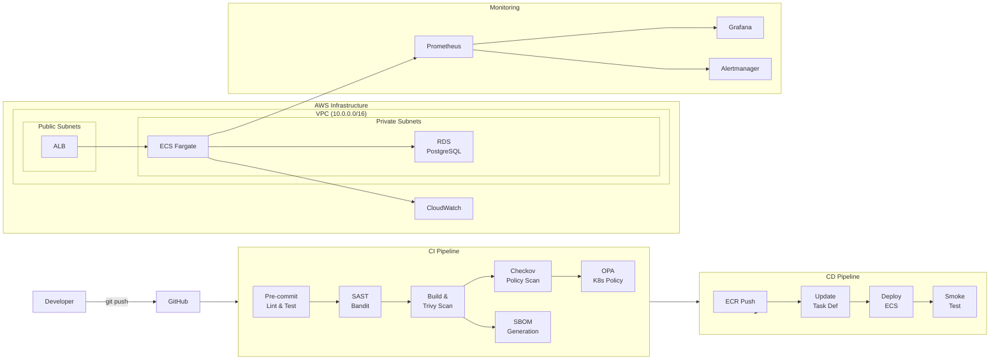

# Secure DevSecOps AWS Pipeline

[](https://github.com/Amirhossein-Asadzadeh/secure-devsecops-aws-pipeline/actions/workflows/ci.yml)
[](https://github.com/Amirhossein-Asadzadeh/secure-devsecops-aws-pipeline/actions/workflows/ci.yml)
[](https://github.com/Amirhossein-Asadzadeh/secure-devsecops-aws-pipeline/actions/workflows/ci.yml)
[](https://github.com/Amirhossein-Asadzadeh/secure-devsecops-aws-pipeline/actions/workflows/ci.yml)
[](https://github.com/Amirhossein-Asadzadeh/secure-devsecops-aws-pipeline/actions/workflows/ci.yml)
[](LICENSE)

Production-grade DevSecOps pipeline that automates the entire software delivery lifecycle — from code commit to production deployment — with security scanning, infrastructure as code, and observability built in.

## Architecture



## Tech Stack

| Layer            | Technology                                      |
|------------------|--------------------------------------------------|
| Application      | Python 3.12, Flask, Gunicorn                     |
| Containerization | Docker (multi-stage, non-root, distroless base)  |
| CI/CD            | GitHub Actions (parallel stages)                 |
| IaC              | Terraform 1.7+ with modular structure            |
| Cloud            | AWS (VPC, ECS Fargate, ECR, RDS, ALB)            |
| Orchestration    | Kubernetes manifests (EKS-ready)                 |
| Security         | Trivy, Bandit, tfsec, OPA, ECR scan-on-push      |
| Monitoring       | Prometheus, Grafana, CloudWatch                  |
| Database         | PostgreSQL 16 (RDS, encrypted, multi-AZ)         |

## CI/CD Workflow

### CI (Continuous Integration)

Triggered on every push to `main`/`develop` and on pull requests:

1. **Lint & Test** — Ruff linter + pytest with coverage reporting
2. **SAST Scan** — Bandit scans Python source for security vulnerabilities
3. **Build & Scan** — Docker image built and scanned by Trivy (blocks on CRITICAL/HIGH)
4. **Terraform Validate** — `fmt`, `validate`, and tfsec checks on infrastructure code
5. **OPA Policy Check** — Kubernetes manifests validated against security policies

### CD (Continuous Deployment)

Triggered only on push to `main` (after CI passes):

1. **Push to ECR** — Tagged with commit SHA, immutable tags enforced
2. **Deploy to ECS** — Rolling update with circuit breaker and automatic rollback
3. **Smoke Test** — Post-deploy health check against ALB endpoint

## Security Controls

| Control                    | Implementation                                     |
|----------------------------|-----------------------------------------------------|
| Container scanning         | Trivy on every build (fail on CRITICAL/HIGH)        |
| SAST                       | Bandit for Python code analysis                     |
| Infrastructure scanning    | tfsec for Terraform misconfigurations               |
| Policy enforcement         | OPA/Rego policies for K8s admission control         |
| Non-root containers        | Dockerfile `USER appuser` + K8s `runAsNonRoot`      |
| Read-only filesystem       | K8s `readOnlyRootFilesystem: true`                  |
| No privilege escalation    | `allowPrivilegeEscalation: false`, all caps dropped |
| Image immutability         | ECR `image_tag_mutability = IMMUTABLE`              |
| Registry whitelisting      | OPA policy blocks images from untrusted registries  |
| Encryption at rest         | RDS `storage_encrypted`, ECR AES256                 |
| Network segmentation       | Private subnets for ECS/RDS, public only for ALB    |
| VPC Flow Logs              | All traffic logged to CloudWatch                    |
| Secrets management         | RDS managed master password (AWS Secrets Manager)   |
| HTTPS enforcement          | ALB HTTP→HTTPS redirect                             |
| OIDC authentication        | GitHub Actions OIDC → AWS (no long-lived keys)      |

## Deployment Strategy

- **Rolling update** with `maxSurge: 1` and `maxUnavailable: 0` (zero-downtime)
- **ECS deployment circuit breaker** with automatic rollback on failure
- **Auto-scaling** based on CPU utilization (target 70%, max 6 tasks)
- **Multi-AZ** deployment for both ECS tasks and RDS
- **Topology spread constraints** for cross-AZ pod distribution

## Monitoring & Alerts

### Metrics Collected
- `http_requests_total` — request count by method, endpoint, status code
- `http_request_duration_seconds` — latency histogram (p50, p95, p99)
- Container Insights — CPU, memory, network via CloudWatch

### Grafana Dashboard
- Request rate (req/s) by status code
- Error rate gauge with thresholds (green < 1%, yellow < 5%, red >= 5%)
- P95 latency with SLA thresholds
- Requests by endpoint breakdown
- Active instance count
- Latency heatmap

### Alert Rules
- **HighErrorRate** — fires when 5xx rate exceeds 5% for 5 minutes
- **HighLatency** — fires when p95 latency exceeds 1s for 5 minutes
- **InstanceDown** — fires when any instance is unreachable for 2 minutes

## How to Run Locally

### Prerequisites
- Python 3.12+
- Docker
- Terraform 1.7+
- AWS CLI configured

### Application

```bash
cd app
pip install -r requirements.txt
python main.py
# API available at http://localhost:8080
```

### Tests

```bash
cd app
python -m pytest tests/ -v --cov=. --cov-report=term-missing
```

### Docker

```bash
docker build -f docker/Dockerfile -t devsecops-app .
docker run -p 8080:8080 devsecops-app
```

### Terraform

```bash
cd terraform
terraform init
terraform plan -var="container_image=devsecops-app:latest" -var="db_username=admin"
```

## Production Considerations

- **State management** — Terraform state stored in S3 with DynamoDB locking and encryption
- **Secrets** — RDS master password managed by AWS Secrets Manager (no plaintext in code)
- **Backup** — RDS automated backups with 7-day retention, manual snapshots before destructive changes
- **Disaster recovery** — Multi-AZ RDS with automatic failover, ECS tasks spread across AZs
- **Cost optimization** — Fargate Spot for non-critical workloads, ECR lifecycle policy (keep last 10 images)
- **Compliance** — VPC Flow Logs for audit trails, CloudWatch log retention policies
- **Scalability** — Auto-scaling on CPU (70% target), ALB distributes traffic, RDS storage auto-scaling up to 100GB
