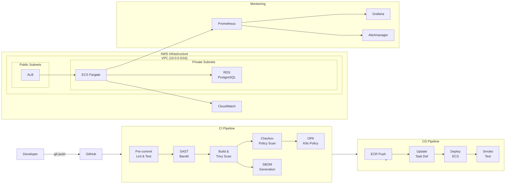

# Secure DevSecOps AWS Pipeline

[](https://github.com/Amirhossein-Asadzadeh/secure-devsecops-aws-pipeline/actions/workflows/ci.yml)
[](https://github.com/Amirhossein-Asadzadeh/secure-devsecops-aws-pipeline/actions/workflows/ci.yml)
[](https://github.com/Amirhossein-Asadzadeh/secure-devsecops-aws-pipeline/actions/workflows/ci.yml)
[](https://github.com/Amirhossein-Asadzadeh/secure-devsecops-aws-pipeline/actions/workflows/ci.yml)
[](https://github.com/Amirhossein-Asadzadeh/secure-devsecops-aws-pipeline/actions/workflows/ci.yml)
[](LICENSE)

Production-grade DevSecOps pipeline that automates the entire software delivery lifecycle — from code commit to production deployment — with security scanning, infrastructure as code, and observability built in.

## Architecture



## Tech Stack

| Layer            | Technology                                      |
|------------------|--------------------------------------------------|
| Application      | Python 3.12, Flask, Gunicorn                     |
| Containerization | Docker (multi-stage, non-root, distroless base)  |
| CI/CD            | GitHub Actions (parallel stages)                 |
| IaC              | Terraform 1.7+ with modular structure            |
| Cloud            | AWS (VPC, ECS Fargate, ECR, RDS, ALB)            |
| Orchestration    | Kubernetes manifests (EKS-ready)                 |
| Security         | Trivy, Bandit, tfsec, OPA, ECR scan-on-push      |
| Monitoring       | Prometheus, Grafana, CloudWatch                  |
| Database         | PostgreSQL 16 (RDS, encrypted, multi-AZ)         |

## CI/CD Workflow

### CI (Continuous Integration)

Triggered on every push to `main`/`develop` and on pull requests:

1. **Lint & Test** — Ruff linter + pytest with coverage reporting
2. **SAST Scan** — Bandit scans Python source for security vulnerabilities
3. **Build & Scan** — Docker image built and scanned by Trivy (blocks on CRITICAL/HIGH)
4. **Terraform Validate** — `fmt`, `validate`, and tfsec checks on infrastructure code
5. **OPA Policy Check** — Kubernetes manifests validated against security policies

### CD (Continuous Deployment)

Triggered only on push to `main` (after CI passes):

1. **Push to ECR** — Tagged with commit SHA, immutable tags enforced
2. **Deploy to ECS** — Rolling update with circuit breaker and automatic rollback
3. **Smoke Test** — Post-deploy health check against ALB endpoint

## Security Controls

| Control                    | Implementation                                     |
|----------------------------|-----------------------------------------------------|
| Container scanning         | Trivy on every build (fail on CRITICAL/HIGH)        |
| SAST                       | Bandit for Python code analysis                     |
| Infrastructure scanning    | tfsec for Terraform misconfigurations               |
| Policy enforcement         | OPA/Rego policies for K8s admission control         |
| Non-root containers        | Dockerfile `USER appuser` + K8s `runAsNonRoot`      |
| Read-only filesystem       | K8s `readOnlyRootFilesystem: true`                  |
| No privilege escalation    | `allowPrivilegeEscalation: false`, all caps dropped |
| Image immutability         | ECR `image_tag_mutability = IMMUTABLE`              |
| Registry whitelisting      | OPA policy blocks images from untrusted registries  |
| Encryption at rest         | RDS `storage_encrypted`, ECR AES256                 |
| Network segmentation       | Private subnets for ECS/RDS, public only for ALB    |
| VPC Flow Logs              | All traffic logged to CloudWatch                    |
| Secrets management         | RDS managed master password (AWS Secrets Manager)   |
| HTTPS enforcement          | ALB HTTP→HTTPS redirect                             |
| OIDC authentication        | GitHub Actions OIDC → AWS (no long-lived keys)      |

## Deployment Strategy

- **Rolling update** with `maxSurge: 1` and `maxUnavailable: 0` (zero-downtime)
- **ECS deployment circuit breaker** with automatic rollback on failure
- **Auto-scaling** based on CPU utilization (target 70%, max 6 tasks)
- **Multi-AZ** deployment for both ECS tasks and RDS
- **Topology spread constraints** for cross-AZ pod distribution

## Monitoring & Alerts

### Metrics Collected
- `http_requests_total` — request count by method, endpoint, status code
- `http_request_duration_seconds` — latency histogram (p50, p95, p99)
- Container Insights — CPU, memory, network via CloudWatch

### Grafana Dashboard
- Request rate (req/s) by status code
- Error rate gauge with thresholds (green < 1%, yellow < 5%, red >= 5%)
- P95 latency with SLA thresholds
- Requests by endpoint breakdown
- Active instance count
- Latency heatmap

### Alert Rules
- **HighErrorRate** — fires when 5xx rate exceeds 5% for 5 minutes
- **HighLatency** — fires when p95 latency exceeds 1s for 5 minutes
- **InstanceDown** — fires when any instance is unreachable for 2 minutes

## How to Run Locally

### Prerequisites
- Python 3.12+
- Docker
- Terraform 1.7+
- AWS CLI configured

### Application

```bash
cd app
pip install -r requirements.txt
python main.py
# API available at http://localhost:8080
```

### Tests

```bash
cd app
python -m pytest tests/ -v --cov=. --cov-report=term-missing
```

### Docker

```bash
docker build -f docker/Dockerfile -t devsecops-app .
docker run -p 8080:8080 devsecops-app
```

### Terraform

```bash
cd terraform
terraform init
terraform plan -var="container_image=devsecops-app:latest" -var="db_username=admin"
```

## Production Deployment Prerequisites

Before running the CD pipeline against a real AWS account, several one-time steps require **manual setup**. The table below separates what the automation handles from what you must configure yourself.

| Step | Automated | Manual |
|---|---|---|
| VPC, ECS, RDS, IAM provisioning | Terraform | — |
| Docker build, scan, push to ECR | GitHub Actions | — |
| ECS rolling deploy + smoke test | GitHub Actions | — |
| TLS certificate issuance | — | ACM (see below) |
| ALB HTTPS listener | — | Terraform variable (see below) |
| DNS record pointing to ALB | — | Your DNS provider |
| K8s Ingress domain name | — | Edit `k8s/ingress.yaml` |
| GitHub Actions AWS credentials | — | GitHub repo secret |
| Terraform bootstrap (S3 + DynamoDB) | — | Run once manually |

---

### 1. Bootstrap Terraform Remote State

Run this **once** before any other Terraform commands:

```bash
cd terraform/bootstrap
terraform init
terraform apply
```

This creates the S3 state bucket (`devsecops-pipeline-tfstate`) and DynamoDB lock table (`terraform-lock`).

---

### 2. Configure GitHub Actions AWS Credentials (OIDC)

The CD pipeline authenticates to AWS via OIDC — no long-lived access keys are stored.

**Step 1 — Deploy the IAM OIDC role** (done by `terraform/modules/iam`):

```bash
cd terraform/environments/dev   # or prod
terraform init
terraform apply
# note the github_actions_role_arn output value
```

**Step 2 — Add the role ARN to GitHub:**

1. Go to your repository → **Settings** → **Secrets and variables** → **Actions**
2. Click **New repository secret**
3. Name: `AWS_ROLE_ARN`
4. Value: the `github_actions_role_arn` output from step 1

The CD pipeline (`cd.yml`) references this secret automatically. No other AWS credentials are needed.

---

### 3. Request a TLS Certificate via ACM

AWS Certificate Manager (ACM) issues free TLS certificates that integrate directly with the ALB.

```bash
# Request a certificate for your domain
aws acm request-certificate \
  --domain-name api.yourdomain.com \
  --validation-method DNS \
  --region us-east-1
```

**Validate via DNS** (recommended — no email required):

```bash
# Retrieve the CNAME record ACM needs you to add
aws acm describe-certificate \
  --certificate-arn arn:aws:acm:us-east-1:ACCOUNT_ID:certificate/CERT_ID \
  --query "Certificate.DomainValidationOptions[0].ResourceRecord"
```

Add the returned `Name` → `Value` CNAME record in your DNS provider. ACM will issue the certificate automatically once DNS propagates (typically 5–30 minutes).

> **Alternative:** Use `--validation-method EMAIL` if you control the domain's admin/postmaster/webmaster inbox. ACM sends a confirmation link.

---

### 4. Add the HTTPS Listener to the ALB

Pass the certificate ARN as a Terraform variable to enable the HTTPS listener on the ALB:

```bash
# terraform/environments/dev/terraform.tfvars
acm_certificate_arn = "arn:aws:acm:us-east-1:ACCOUNT_ID:certificate/CERT_ID"
```

Then re-apply Terraform:

```bash
cd terraform/environments/dev
terraform apply
```

The ECS module will create an ALB listener on port 443 using the certificate. The existing HTTP listener already redirects to HTTPS (301).

---

### 5. Configure DNS to Point to the ALB

After Terraform apply, retrieve the ALB DNS name:

```bash
terraform -chdir=terraform/environments/dev output alb_dns_name
# e.g. devsecops-pipeline-alb-123456789.us-east-1.elb.amazonaws.com
```

In your DNS provider, create a **CNAME** record:

```
api.yourdomain.com  →  devsecops-pipeline-alb-123456789.us-east-1.elb.amazonaws.com
```

> If your DNS provider supports **ALIAS** records (e.g. Route 53), use an ALIAS instead of CNAME for the zone apex (`yourdomain.com`).

---

### 6. Update the Kubernetes Ingress (EKS deployments only)

If deploying to EKS rather than ECS, update two placeholders in [k8s/ingress.yaml](k8s/ingress.yaml):

```yaml
# Replace the placeholder host
spec:
  rules:
    - host: api.yourdomain.com   # ← your actual domain

# Add the TLS secret name (from cert-manager or manual secret)
  tls:
    - hosts:
        - api.yourdomain.com
      secretName: devsecops-app-tls  # ← name of the K8s TLS secret
```

If using **cert-manager**, annotate the Ingress instead of specifying a secret manually:

```yaml
annotations:
  cert-manager.io/cluster-issuer: letsencrypt-prod
```

---

### 7. Update the Kubernetes Deployment Image (EKS deployments only)

Replace the placeholder in [k8s/deployment.yaml](k8s/deployment.yaml) with your actual ECR registry:

```yaml
image: <YOUR_ACCOUNT_ID>.dkr.ecr.us-east-1.amazonaws.com/devsecops-pipeline-app:<TAG>
```

The CD pipeline sets this automatically for ECS. For EKS, you can use `envsubst` or Helm values to inject the correct image at deploy time.

---

## Database Migrations

Schema changes are managed through versioned SQL files in [app/migrations/](app/migrations/).
The migration runner is **idempotent** — re-running it is always safe.

### How it works

| File | Purpose |
|---|---|
| `app/migrations/migrate.py` | Migration runner script |
| `app/migrations/*.sql` | Numbered SQL files applied in filename order |

The runner maintains a `schema_migrations` table in the database that records which versions have been applied. On each run it skips files already present in that table and applies only new ones.

### Running migrations

Set the same environment variables used by the application, then run:

```bash
# Export connection details (or put them in a .env file)
export DB_HOST=your-rds-endpoint.us-east-1.rds.amazonaws.com
export DB_NAME=appdb
export DB_USER=appuser
export DB_PASSWORD=your-password   # retrieve from AWS Secrets Manager

python app/migrations/migrate.py
```

Example output on a fresh database:

```
2026-02-18 10:00:00 [INFO] Connecting to your-rds-endpoint:5432/appdb
2026-02-18 10:00:00 [INFO] APPLY 001_initial_schema
2026-02-18 10:00:01 [INFO] OK    001_initial_schema
2026-02-18 10:00:01 [INFO] Applied 1 migration(s) successfully
```

Re-running on an already-migrated database:

```
2026-02-18 10:05:00 [INFO] SKIP  001_initial_schema (already applied)
2026-02-18 10:05:00 [INFO] Nothing to do — database is up to date
```

### Adding a new migration

1. Create a new file following the naming convention:
   ```
   app/migrations/002_add_description_column.sql
   ```
2. Write idempotent SQL (use `IF NOT EXISTS` / `IF EXISTS` guards):
   ```sql
   ALTER TABLE items ADD COLUMN IF NOT EXISTS description TEXT;
   ```
3. Run `python app/migrations/migrate.py` — only the new file will be applied.

### Production deployment order

Always run migrations **before** deploying a new application version so the schema is in place when the new code starts:

```
1. terraform apply          ← infrastructure changes (if any)
2. python migrate.py        ← schema changes
3. CD pipeline deploys app  ← new application version
```

> **Tip:** Retrieve the RDS password from AWS Secrets Manager before running migrations:
> ```bash
> export DB_PASSWORD=$(aws secretsmanager get-secret-value \
>   --secret-id devsecops-pipeline/rds-password \
>   --query SecretString --output text | jq -r .password)
> ```

---

## Production Considerations

- **State management** — Terraform state stored in S3 with DynamoDB locking and encryption
- **Secrets** — RDS master password managed by AWS Secrets Manager (no plaintext in code)
- **Backup** — RDS automated backups with 7-day retention, manual snapshots before destructive changes
- **Disaster recovery** — Multi-AZ RDS with automatic failover, ECS tasks spread across AZs
- **Cost optimization** — Fargate Spot for non-critical workloads, ECR lifecycle policy (keep last 10 images)
- **Compliance** — VPC Flow Logs for audit trails, CloudWatch log retention policies
- **Scalability** — Auto-scaling on CPU (70% target), ALB distributes traffic, RDS storage auto-scaling up to 100GB
